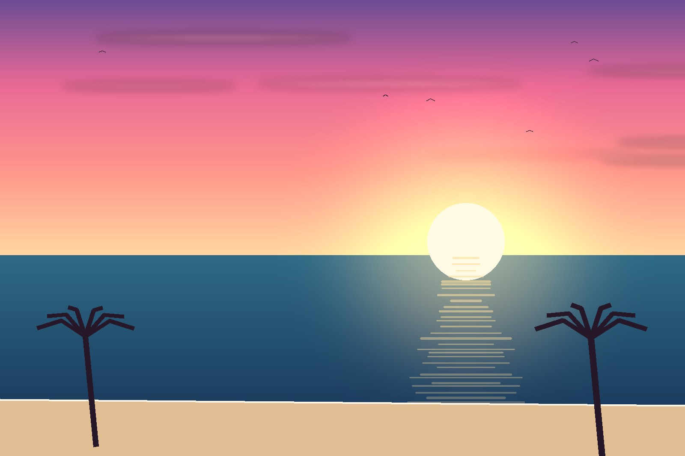
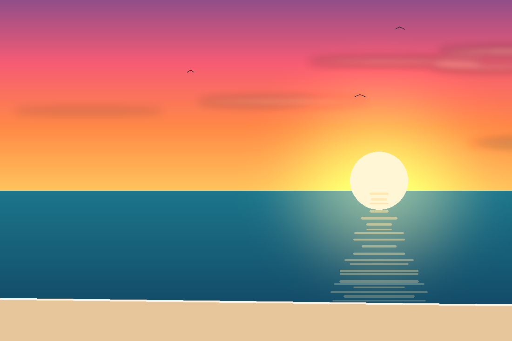

<div align="center">

# 🌅 Foto di prova

**Immagini pronte all'uso per testare Golden Hour**


*Generate via codice, quindi liberamente utilizzabili* ✨

</div>

---

## 🖼️ La galleria

<table>
  <tr>
    <td width="33%" align="center">
      <br />
      <b>tramonto-sul-mare.jpg</b><br />
      <sub>JPEG · 1600×1067 · 82 KB</sub>
    </td>
    <td width="33%" align="center">
      <br />
      <b>spiaggia-con-palme.jpg</b><br />
      <sub>JPEG · 1600×1067 · 93 KB</sub>
    </td>
    <td width="33%" align="center">
      <br />
      <b>riflessi-sull-acqua.jpg</b><br />
      <sub>JPEG · 1920×1280 · 115 KB</sub>
    </td>
  </tr>
  <tr>
    <td width="33%" align="center">
      <br />
      <b>ultima-luce.png</b><br />
      <sub>PNG · 1280×854 · 88 KB</sub>
    </td>
    <td width="33%" align="center">
      <br />
      <b>battigia.png</b><br />
      <sub>PNG · 1100×733 · 74 KB</sub>
    </td>
    <td width="33%" align="center">
      <br /><br />
      🏖️<br /><br />
      <sub>Tutte sotto i 5 MB<br />Caricabili singolarmente<br />o fino a 10 insieme</sub>
      <br /><br />
    </td>
  </tr>
</table>

> 💡 **Come usarle:** vai su **Pubblica**, scegli la scheda **Carica** e
> trascinale nell'area tratteggiata, oppure cliccala per aprire il
> selettore file.

---

## 🧪 I due file per testare la validazione

Questi non sono foto vere: servono a dimostrare che i controlli sui
formati funzionano davvero.

### 🎭 `finta-foto.jpg` — il travestimento


È un **file di testo rinominato** in `.jpg`. Il nome dice "immagine",
il contenuto no.

| Dove | Cosa succede |
|:---|:---|
| 🖥️ **Frontend** | Bloccato **prima dell'invio**. Legge i primi byte del file (i *magic bytes*) e vede che non corrispondono a nessun formato immagine |
| ⚙️ **Backend** | Rifiutato con **415** anche saltando il frontend. Non si fida né dell'estensione né del tipo dichiarato: legge il contenuto reale con Apache Tika e prova a decodificarlo |

**Provalo direttamente sul backend**, bypassando il frontend:

```bash
curl -X POST http://localhost:8080/api/posts \
  -F 'post={"text":"prova","captureMode":"UPLOAD"};type=application/json' \
  -F 'photos=@foto-di-prova/finta-foto.jpg'
```

Risposta:

```json
{
  "status": 415,
  "message": "Uno o piu' file non sono validi",
  "details": ["finta-foto.jpg: Formato file non supportato: text/plain"]
}
```

### 🏋️ `troppo-grande.jpg` — oltre il limite


Un'immagine **vera**, ma troppo pesante. Il frontend la blocca dicendo
quanto pesa e qual è il massimo consentito. Il backend ha un limite suo
di 10 MB per file (in `application.properties`) e risponde **413** se
viene superato.

Contiene rumore casuale apposta: non si comprime, così bastano
dimensioni contenute per superare i 5 MB senza appesantire inutilmente
il repository.

---

## 🔐 Perché due controlli e non uno

<div align="center">

| | 🖥️ Frontend | ⚙️ Backend |
|:---|:---|:---|
| **A cosa serve** | All'utente | Alla sicurezza |
| **Cosa dà** | Risposta immediata, niente attesa inutile | L'unica barriera che conta |
| **Si può aggirare?** | ✅ Sì, con Postman | ❌ No |

</div>

> ⚠️ Chiunque può saltare il frontend e chiamare l'API direttamente.
> Per questo il backend **rifà tutti i controlli da zero**, leggendo il
> contenuto reale del file invece di fidarsi di quello che gli viene
> dichiarato.

---

<div align="center">
<sub>🌅 Golden Hour · progetto didattico · React + Spring Boot</sub>
</div>
